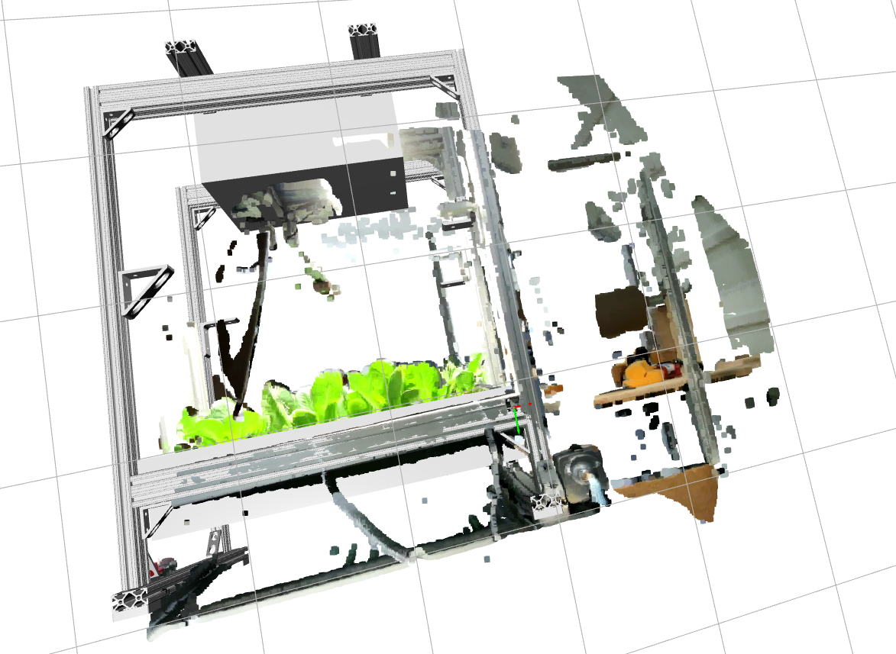
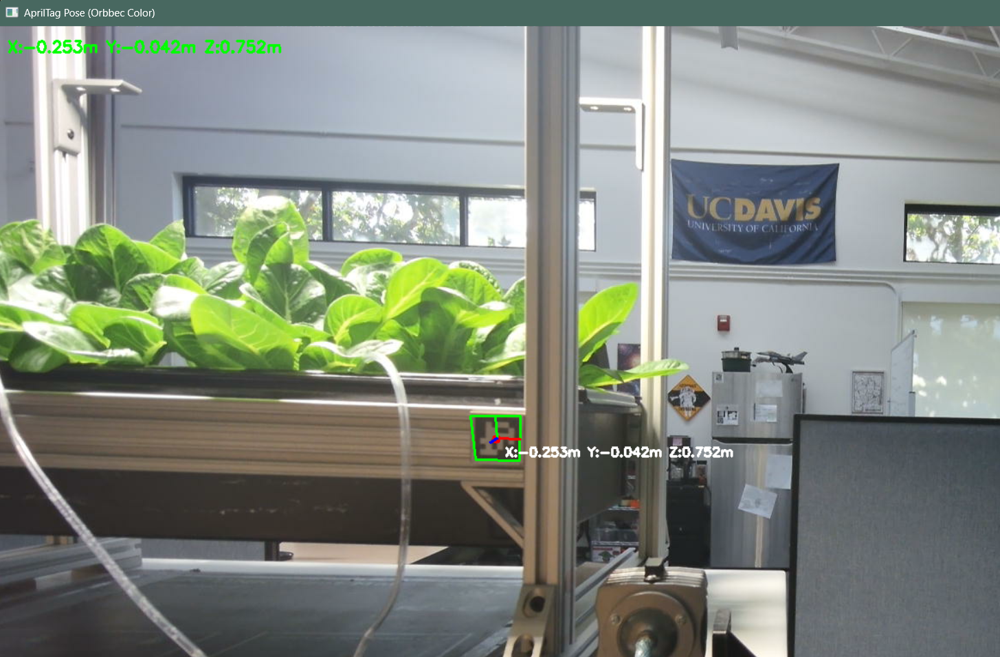
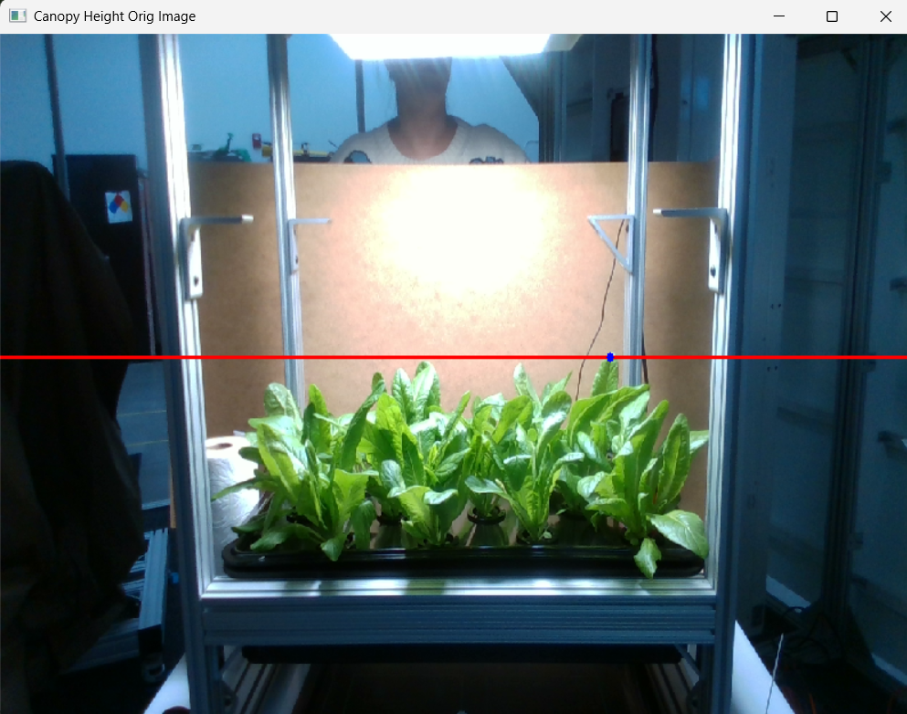
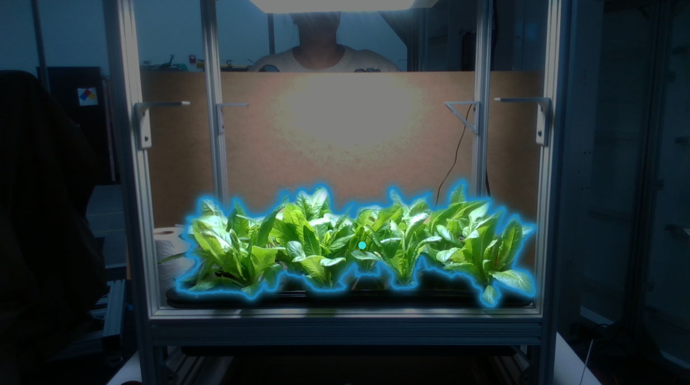

# Computer Vision System for Hydroponic System Detection and Plant Canopy Detection using April Tags 

A comprehensive computer vision system designed for indoor hydroponic environment monitoring, featuring dual-camera support with advanced 3D pose estimation, point cloud generation, and CAD model visualization capabilities.

## 🎯 Project Overview

This repository contains two complete computer vision systems built around different camera technologies:

- **Femto Bolt Camera System**: Time-of-Flight depth sensing with high-resolution color imaging
- **RealSense D415i Stereo Camera System**: Stereo depth sensing with IMU integration

Both systems provide real-time AprilTag detection, 6DOF pose estimation, point cloud generation, and CAD model visualization for hydroponic monitoring applications.

---

## 🚀 Key Capabilities

### 🔍 **AprilTag Detection & Pose Estimation**
- Real-time AprilTag detection using tag36h11 family
- 6DOF pose estimation with solvePnP
- Multiple tag detection and tracking
- Robust corner refinement and validation

### 📊 **3D Data Capture & Processing**
- RGB-D data capture with timestamped storage
- Point cloud generation (PLY format)
- Aligned depth and color streams
- Distance-based masking and filtering

### 🎨 **CAD Model Integration**
- STL/PLY model loading and visualization
- Automatic coordinate system alignment
- Real-time 3D rendering with Open3D
- Configurable scaling and rotation

### 📐 **Camera Calibration**
- Factory intrinsics extraction
- Checkerboard calibration support
- Distortion correction
- Multi-resolution calibration

---

## 📷 Camera Systems

### 🔵 **Femto Bolt ToF Camera System**

**Hardware Specifications:**
- **Sensor**: Time-of-Flight (ToF) depth sensor
- **Chosen Resolution**: 1280x720 color @ 30fps, 640x480 depth @ 30fps
- **Range**: 0.3m - 3.0m
- **FOV**: 69° x 55° (H x V)

**Key Scripts & Features:**
- **`april_tag_detector_solvepnp.py`**: Real-time AprilTag detection and pose estimation
- **`better_three_capture.py`**: Simultaneous multi-file RGB-D-PLY capture system
- **`final_view_with_cad.py`**: Complete CAD model integration and visualization
- **`checkerboard_callibration.py`**: Camera calibration using checkerboard patterns
- **`rgbd_viewer.py`**: Real-time RGB-D stream viewer

**Captured Sample Data:**
- **6 hydroponic system captures**: Real-world system data (ready for AprilTag detection)
- **4 validation captures**: Potted plant in 4 rotations (useful for experimenting combining point clouds)
- **Factory & Manual calibration data**: Pre-calibrated intrinsics and extrinsics
- NOTE: Ply files greater than 100 mb will not exist here because of gihtub restrictions

### 🔴 **RealSense D415i Stereo Camera System**

**Hardware Specifications:**
- **Sensor**: Stereo depth with IMU
- **Chosen Resolution**: 640x480 color @ 30fps, 640x480 depth @ 30fps
- **Range**: 0.16m - 10.0m
- **FOV**: 69.4° x 42.5° (H x V)

**Key Scripts & Features:**
- **`realtime_pose_estimation_april_tag.py`**: Real-time AprilTag pose estimation
- **`capture_aligned_all.py`**: Aligned RGB-D data and PLY capture
- **`capture_aligned_pointcloud.py`**: Specialized point cloud generation
- **`vis_tool_solvepnp.py`**: solvePnP pose estimation visualization
- **`checkerboard_caliberation.py`**: Camera calibration system

**Captured Data:**
- **Aligned outputs**: Test data with RGB, depth, and PLY files
- **Canopy detection captures**: Specialized plant monitoring data
- **Factory calibration data**: Pre-calibrated intrinsics and extrinsics

---

## 🛠️ Setup Instructions

**⚠️ Important**: Each camera system requires a separate virtual environment with Python 3.11 for optimal Open3D compatibility.

### Quick Setup
1. **Navigate to the desired camera system directory**
2. **Create and activate virtual environment** (see individual READMEs for details)
3. **Install dependencies** from requirements.txt
4. **Run the desired scripts**

### Detailed Setup
For complete setup instructions, virtual environment configuration, and dependency management, please refer to the individual README files:

- **Femto Bolt System**: See [`femto_bolt_code/README.md`](femto_bolt_code/README.md)
- **RealSense D415i System**: See [`realsense_d415i/README.md`](realsense_d415i/README.md)

---

## 📂 Project Structure

```
HRVIP Vision Work/
├── femto_bolt_code/              # Femto Bolt ToF camera system
│   ├── scripts/                  # Main application scripts
│   │   ├── calibration_parameters/  # Camera calibration data
│   │   ├── four_pose_captures/      # Validation data (4 rotations)
│   │   └── hydroponic_system_captures/  # Production data (6 captures)
│   └── README.md                 # Detailed setup and usage guide
│
├── realsense_d415i/              # RealSense D415i stereo camera system
│   ├── april_tag_detection_caliberation/  # Detection and calibration
│   ├── capture_scripts/          # Data capture and processing
│   ├── testing_scripts/          # Testing and validation
│   ├── vis_tool/                 # Visualization tools
│   └── README.md                 # Detailed setup and usage guide
│
├── cad_model/                    # 3D CAD models for visualization
│   ├── Structure2.PLY           # Main hydroponic structure model
│   └── StructureResvrLightBox_AprilTagOrigin.stl
│
└── git_images/                   # Example outputs and documentation
    ├── canopy_line.png          # Canopy detection example
    └── segmented_plants.png     # Plant segmentation example
```

---

## 🎯 Use Cases & Applications

### **Hydroponic System Monitoring**
- Real-time plant growth tracking
- 3D structure visualization
- Automated pose estimation for robotic systems
- Point cloud analysis for plant health assessment

### **Research & Development**
- Multi-camera system comparison
- Calibration validation and testing
- 3D reconstruction and analysis
- CAD model integration for design validation

### **Educational & Training**
- Computer vision algorithm implementation
- 3D data processing and visualization
- Camera calibration techniques
- AprilTag detection and pose estimation

---

## 📊 Example Outputs

### Transformed CAD Model in Open3D


### April tag detection and Pose estimation


### Canopy Detection


### SAM Segmentation



---

## 🚀 Quick Start Guide

### For Femto Bolt Users:
```bash
cd femto_bolt_code
# Follow setup instructions in femto_bolt_code/README.md
python scripts/april_tag_detector_solvepnp.py
```

### For RealSense D415i Users:
```bash
cd realsense_d415i
# Follow setup instructions in realsense_d415i/README.md
python april_tag_detection_caliberation/realtime_pose_estimation_april_tag.py
```

---