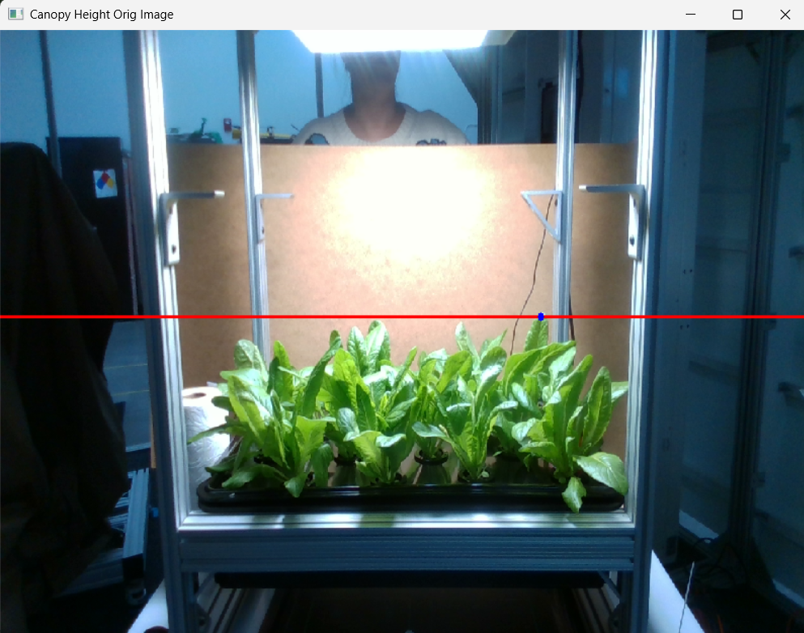
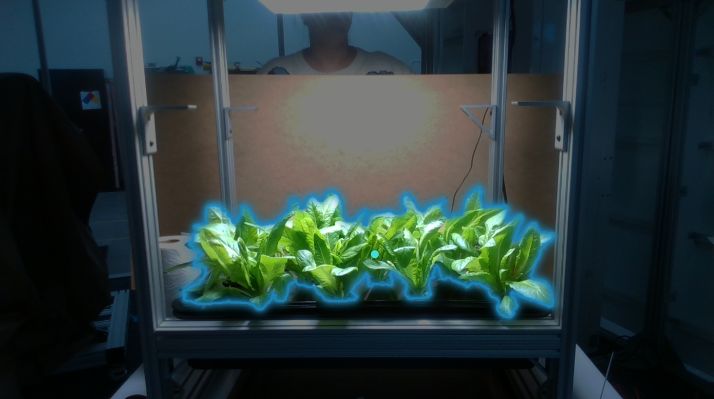
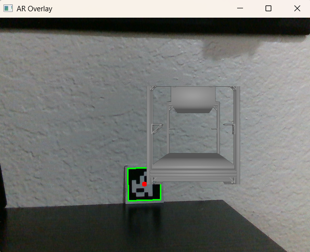
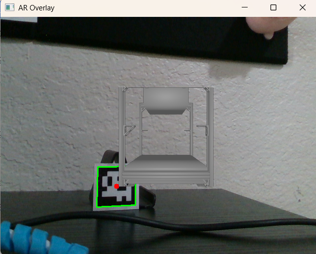

# Canopy & AprilTag Detection

A collection of scripts for converting ROS bag files to images, detecting AprilTags, overlaying 3D STL models, and performing edge/background extraction.

---

## 📋 Prerequisites

* **Python**: 3.9.13
* **Virtual environment**: `venv` (or your choice of environment manager)

---

## 🛠️ Setup

1. **Create a virtual environment**

   ```bash
   python3.9 -m venv .venv
   ```

2. **Activate**

   * **macOS / Linux**

     ```bash
     source .venv/bin/activate
     ```
   * **Windows (CMD)**

     ```powershell
     .venv\Scripts\activate
     ```

3. **Install dependencies**

   ```bash
   pip install --upgrade pip
   pip install -r requirements.txt
   ```

---

## ▶️ Usage

Run any script with:

```bash
python <script_name>.py
```

Example:

```bash
python canopy_detection/image_capture.py
```

---

## 📂 Project Structure

```
.
├── canopy_detection
│   ├── bag_to_img.py         # Convert ROS bag files to image sequence
│   ├── combined-logic.py     # Edge detection + background extraction pipeline
│   └── image_capture.py      # Capture live images from camera
│
└── april_tag_code
    ├── april_tag_detector.py # Real‑time AprilTag detection & coordinate display
    ├── intrinsic-1.py        # (Valentina) Compute camera intrinsics
    ├── intrinsic-2.py        # (Valentina) Apply transforms & 3D Plotly visualization
    └── stl_overlay.py        # Overlay STL model at AprilTag position
```

---

## Example Outputs

```

### Canopy Detection


### SAM Segmentation


### AprilTag + STL Overlay - 1


### AprilTag + STL Overlay - 2


```

## 🤝 Contributing

1. Fork the repository
2. Create a feature branch (`git checkout -b feature/YourFeature`)
3. Commit your changes (`git commit -m "Add your feature"`)
4. Push to your branch (`git push origin feature/YourFeature`)
5. Open a pull request

---
